# Структура базы данных

## Связи таблиц
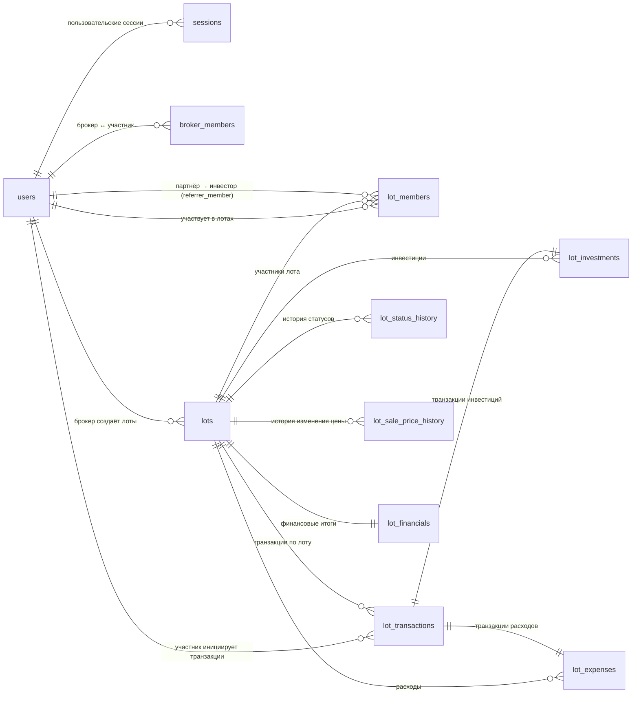

## users
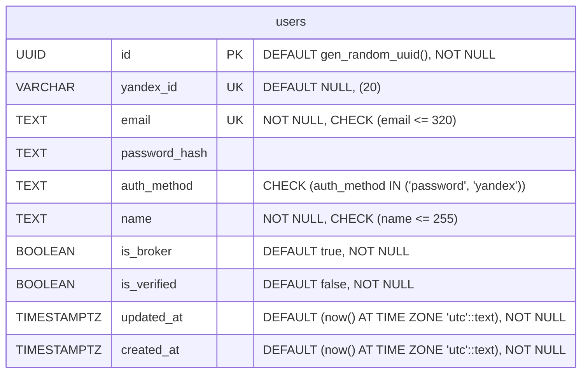

## sessions
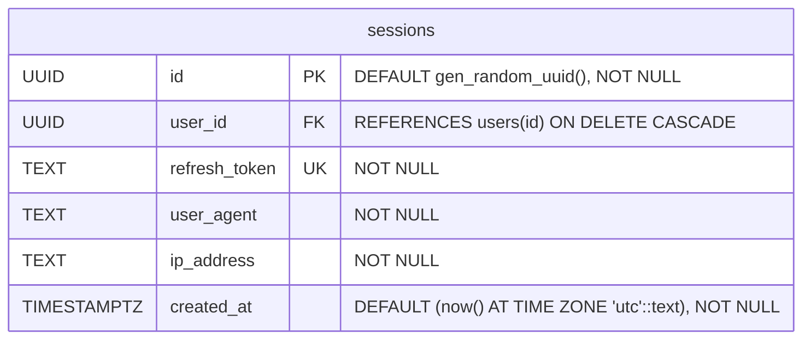

## broker_members
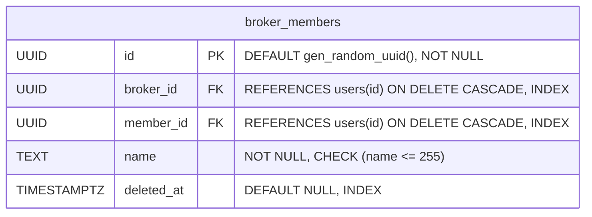
> **Примечание**: В таблице `broker_members` установлены индексы для оптимизации выборок:  
> `broker_id`, `member_id` и `deleted_at` — для ускорения фильтрации по брокеру, участнику и учёта мягкого удаления.  
> `UNIQUE (broker_id, member_id)` — для исключения повторного добавления одного и того же участника к брокеру.

## lots
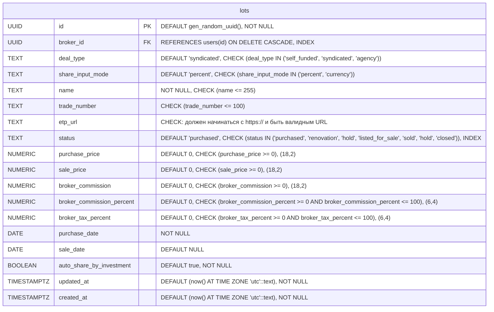
> **Примечание**: В таблице `lots` установлены индексы для оптимизации выборок:  
> `broker_id` — для получения списка лотов конкретного брокера  
> `status` — для фильтрации лотов по текущему статусу (например, при отображении активных или завершённых лотов)

## lot_sale_price_history
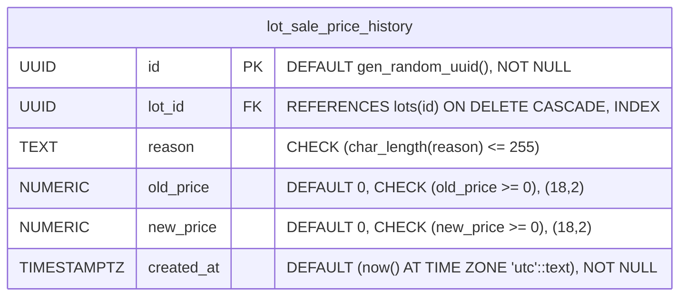
> **Примечание**: В таблице `lot_sale_price_history` установлены индексы для оптимизации выборок:  
> `lot_id` — для ускорения выборки.

## lot_status_history
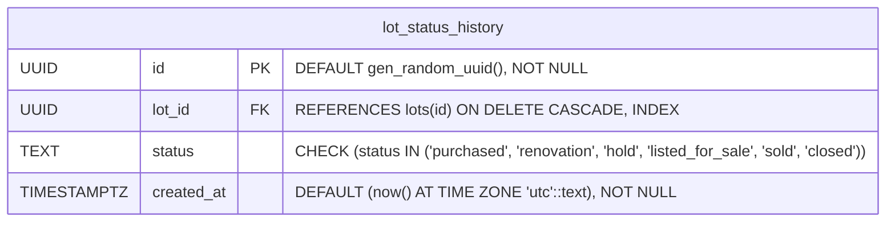
> **Примечание**: В таблице `lot_status_history` установлены индексы для оптимизации выборок:  
> `lot_id` — для ускорения выборки.

## lot_members
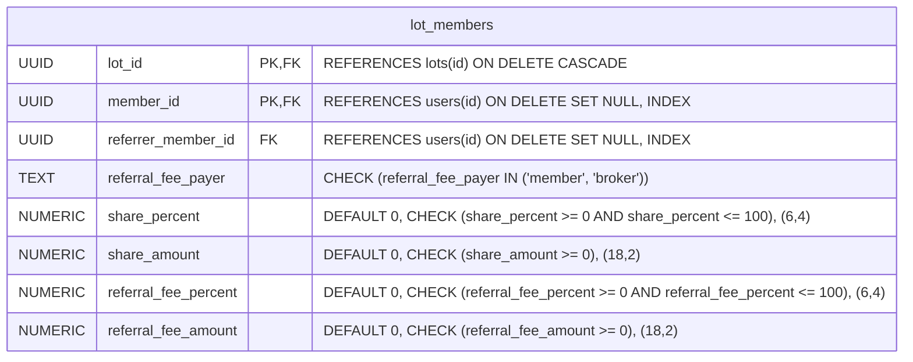
> **Примечание**: В таблице `lot_members` применяется составной первичный ключ и индексы:  
> `member_id` и `referrer_member_id` — для оптимизации выборки участников и их рефералов.  
> `PRIMARY KEY (lot_id, member_id)` — исключает добавление одного и того же участника в один лот более одного раза.

## lot_investments
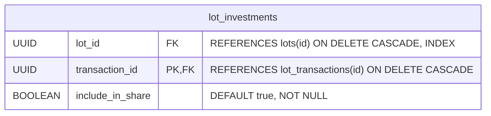
> **Примечание**: В таблице `lot_investments` установлены индексы для оптимизации выборок:  
> `lot_id` — для ускорения выборки.

## lot_expenses
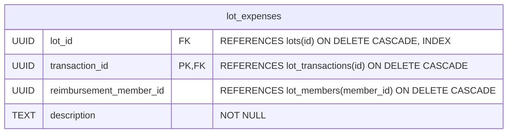
> **Примечание**: В таблице `lot_expenses` установлены индексы для оптимизации выборок:  
> `lot_id` — для ускорения выборки.

## lot_transactions
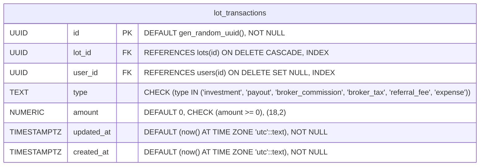
> **Примечание**: В таблице `lot_transactions` установлены индексы для оптимизации выборок:  
> `lot_id` — для ускорения выборки.

## lot_financials
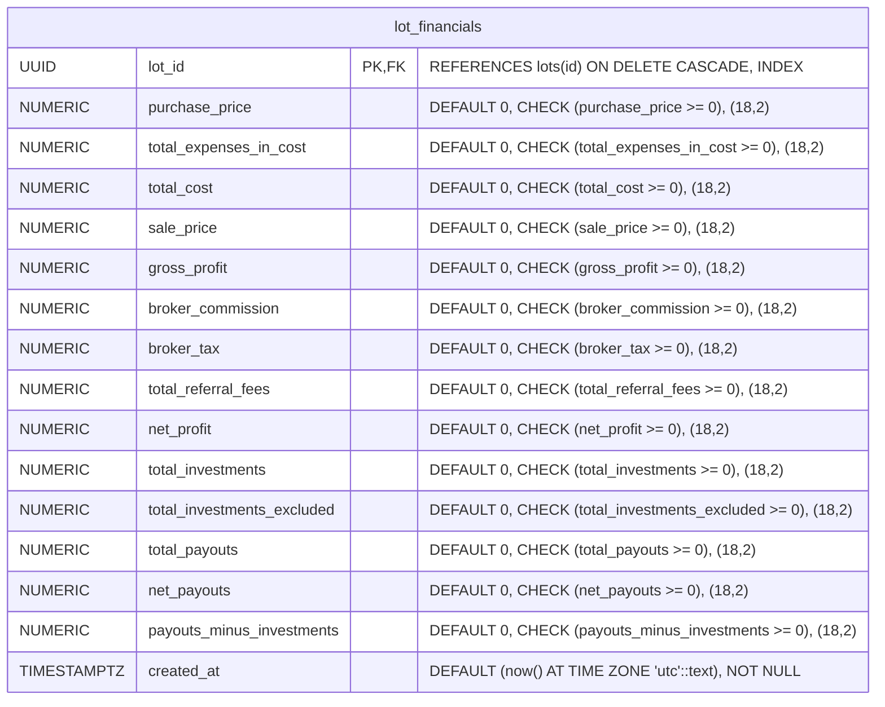
> **Примечание**: В таблице `lot_transactions` установлены индексы для оптимизации выборок:  
> `lot_id` — для ускорения выборки.