# Структура базы данных

## Связи таблиц
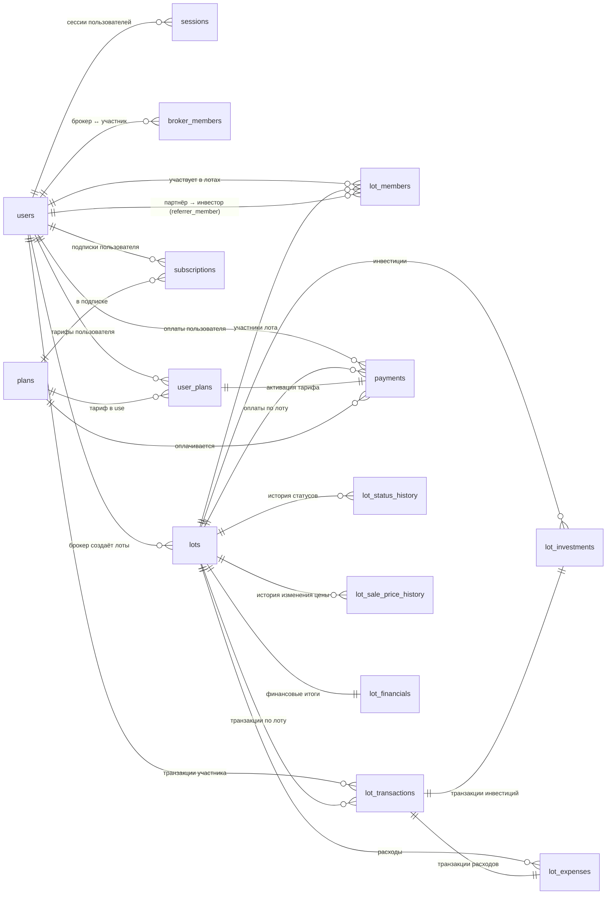

## users
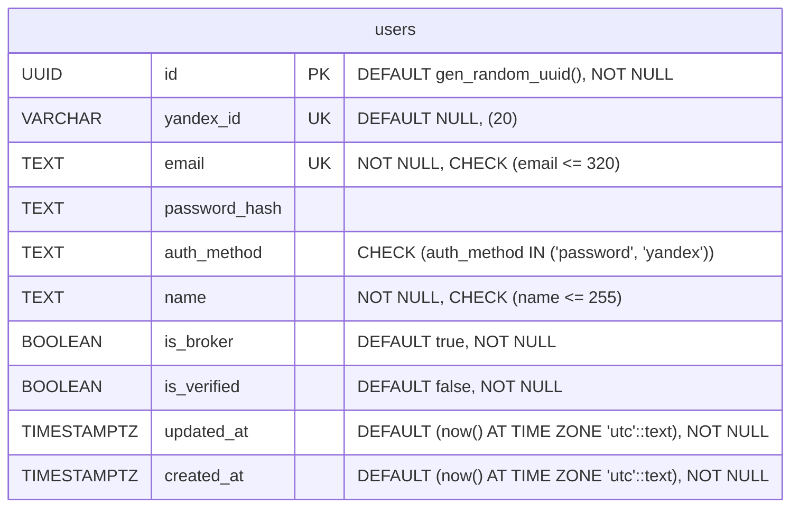

## sessions
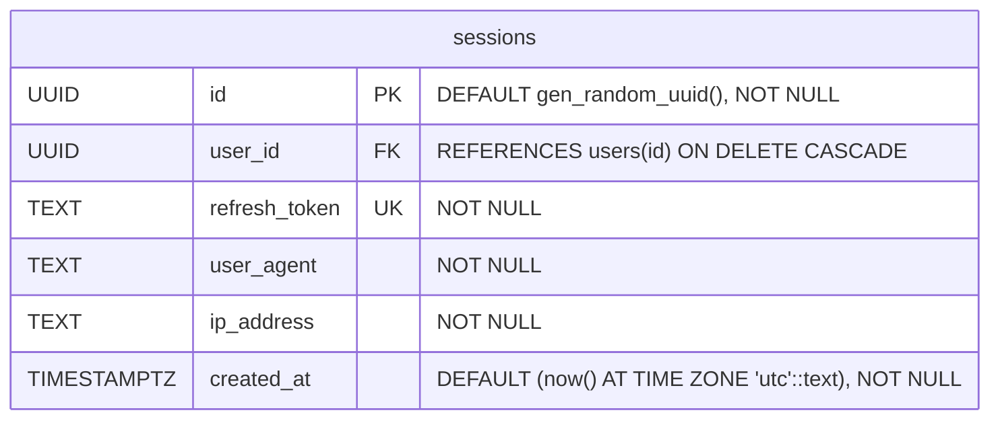

## plans
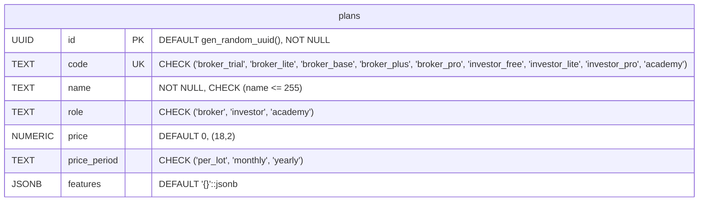
> **Примечание**: В таблице `plans` предусмотрены ключевые ограничения:  
> `code` — UNIQUE, используется как стабильный идентификатор тарифа;  
> `role`, `price_period` — CHECK-ограничения для валидации допустимых значений.

## user_plans
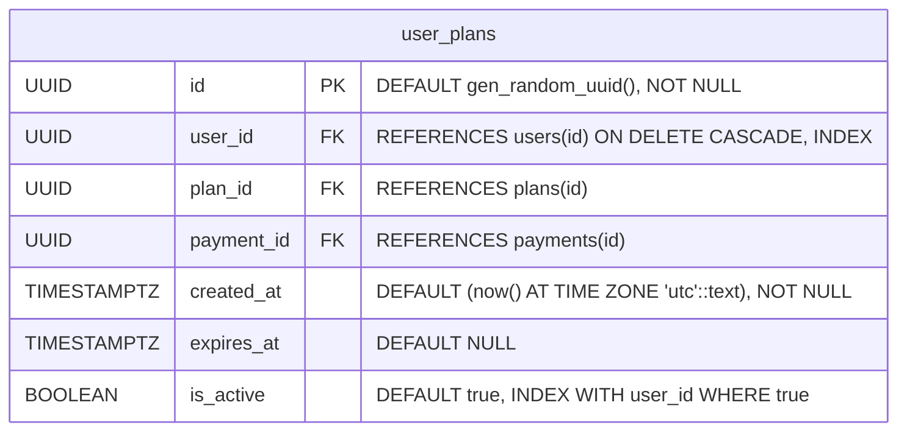
> **Примечание**: В таблице `user_plans` установлены индексы для оптимизации доступа к активному тарифу пользователя:  
> `user_id` — для получения всех тарифов пользователя;  
> `INDEX (user_id, is_active) WHERE is_active` = `true` — для быстрого получения текущего активного тарифа.  
> Также присутствует внешний ключ `payment_id` — для привязки к оплате.

## payments
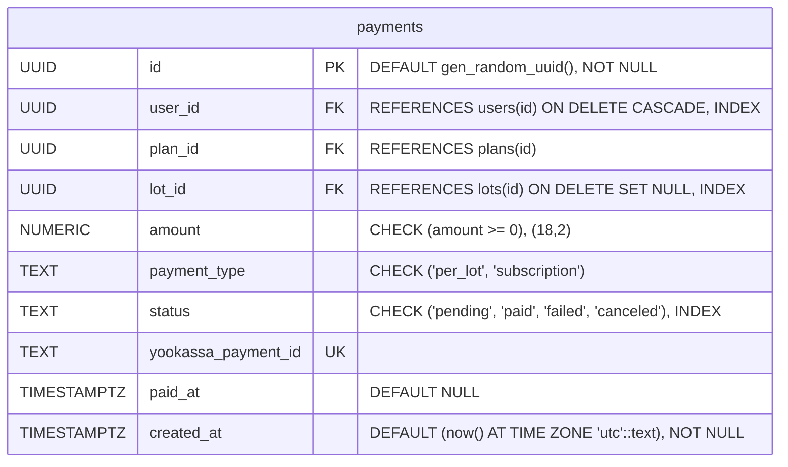
> **Примечание**: В таблице `payments` установлены индексы для ускорения выборок и обработки оплат:  
> `user_id` — для фильтрации всех оплат пользователя;  
> `status` — для отслеживания состояния транзакций (например, при вебхуке);  
> `lot_id` — индекс по `lot_id` с условием `WHERE lot_id IS NOT NULL` используется только для оплат по лоту;  
> `yookassa_payment_id` — UNIQUE, используется для сопоставления входящих уведомлений от платёжной системы.

## subscriptions
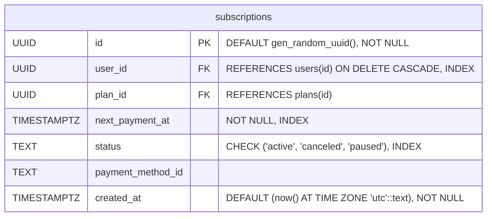
> **Примечание**: В таблице `subscriptions` предусмотрены индексы для поддержки периодических автосписаний и состояния подписок:  
> `user_id` — для быстрого получения подписки пользователя;  
> `status` — для фильтрации активных / приостановленных / отменённых подписок;  
> `next_payment_at` — индекс используется воркером / cron-задачей для поиска подписок, требующих списания.

## broker_members
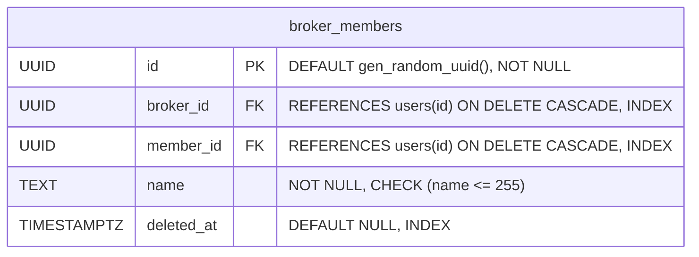
> **Примечание**: В таблице `broker_members` установлены индексы для оптимизации выборок:  
> `broker_id`, `member_id` и `deleted_at` — для ускорения фильтрации по брокеру, участнику и учёта мягкого удаления.  
> `UNIQUE (broker_id, member_id)` — для исключения повторного добавления одного и того же участника к брокеру.

## lots
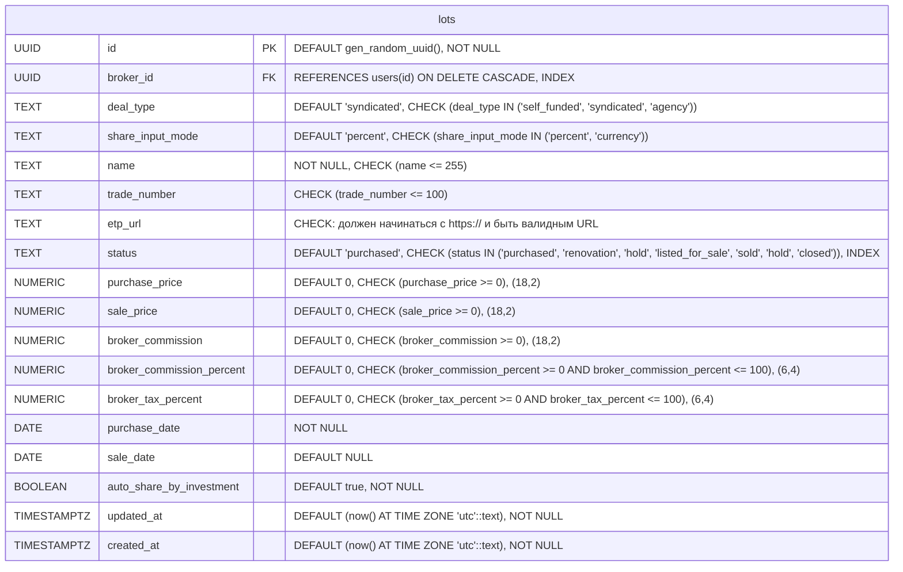
> **Примечание**: В таблице `lots` установлены индексы для оптимизации выборок:  
> `broker_id` — для получения списка лотов конкретного брокера  
> `status` — для фильтрации лотов по текущему статусу (например, при отображении активных или завершённых лотов)

## lot_sale_price_history
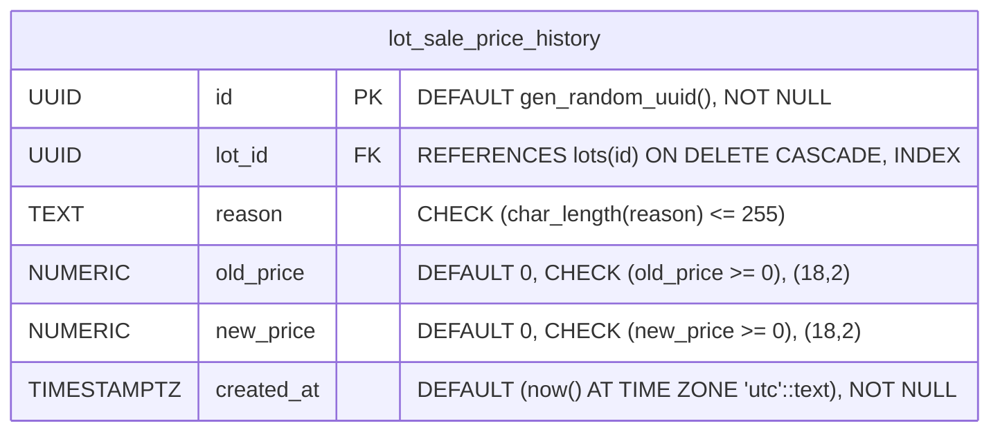
> **Примечание**: В таблице `lot_sale_price_history` установлены индексы для оптимизации выборок:  
> `lot_id` — для ускорения выборки.

## lot_status_history
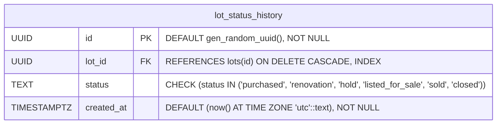
> **Примечание**: В таблице `lot_status_history` установлены индексы для оптимизации выборок:  
> `lot_id` — для ускорения выборки.

## lot_members
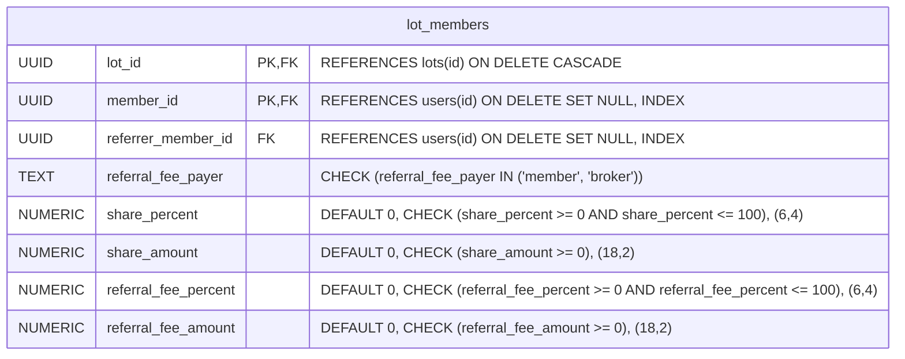
> **Примечание**: В таблице `lot_members` применяется составной первичный ключ и индексы:  
> `member_id` и `referrer_member_id` — для оптимизации выборки участников и их рефералов.  
> `PRIMARY KEY (lot_id, member_id)` — исключает добавление одного и того же участника в один лот более одного раза.

## lot_investments
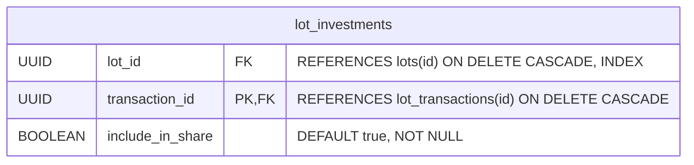
> **Примечание**: В таблице `lot_investments` установлены индексы для оптимизации выборок:  
> `lot_id` — для ускорения выборки.

## lot_expenses
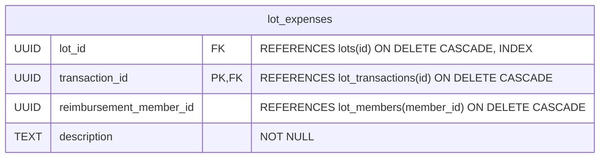
> **Примечание**: В таблице `lot_expenses` установлены индексы для оптимизации выборок:  
> `lot_id` — для ускорения выборки.

## lot_transactions
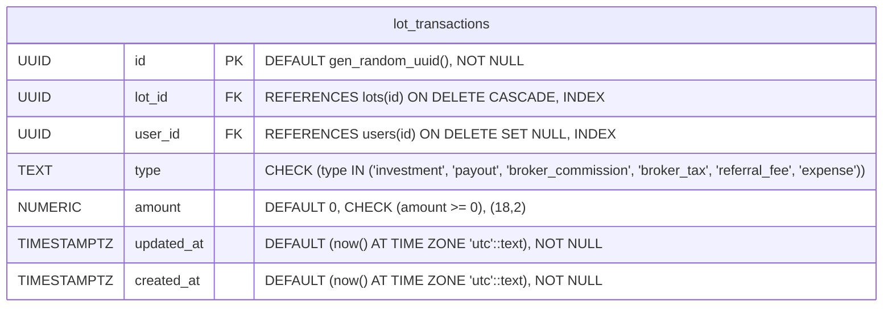
> **Примечание**: В таблице `lot_transactions` установлены индексы для оптимизации выборок:  
> `lot_id` — для ускорения выборки.

## lot_financials
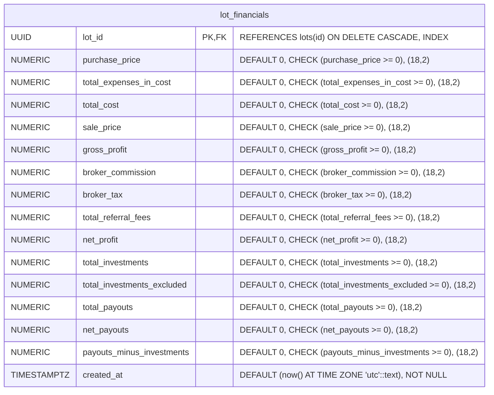
> **Примечание**: В таблице `lot_transactions` установлены индексы для оптимизации выборок:  
> `lot_id` — для ускорения выборки.